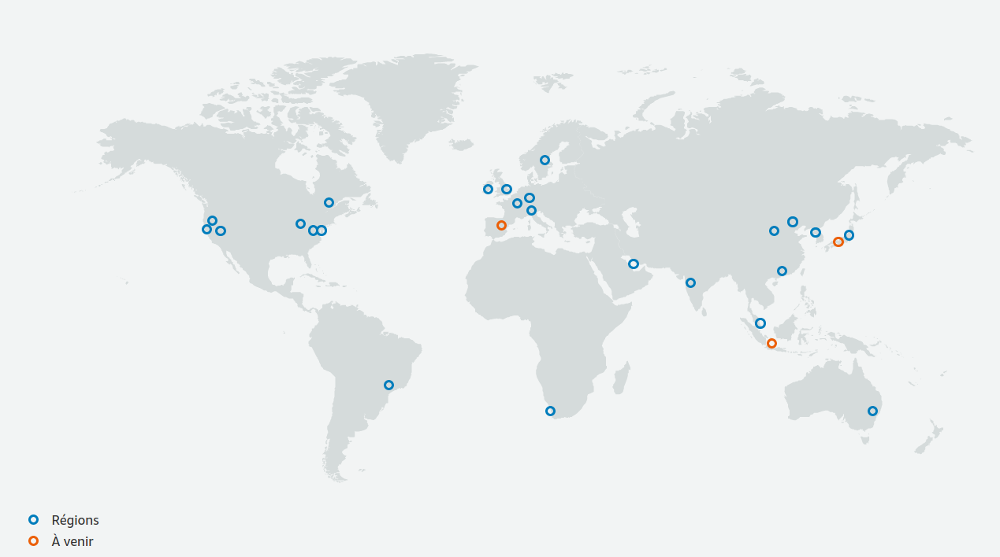

## Infrastructure AWS

L'infrastructure d'AWS est séparée en 3 parties:
- Les régions
- Les zones de disponibilité (Availability Zones)
- Les points de présence (Edge Location)

### Régions AWS

Une région est une zone géographique définie composée de deux ou plus zones de disponibilité. 

Certains services ne sont pas disponibles dans certaines régions et les prix ne sont pas les mêmes d'une région à l'autre.

En 2020, on compte 24 régions dans le monde, visibles sur la carte ci-dessous.

### Zone de disponibilité

Chaque zone de disponibilité est composée de un ou plus datacenters. 

Les zones de disponibilité sont séparées les unes des autres dans et elles sont reliées entre elles par des connections haut débit privée.

Un datacenter ne peut pas être présent dans plusieurs AZ.

### Points de présence

Il s'agit de là où les utilisateurs peuvent accéder aux services AWS.

Elles sont situées dans des "Grande Villes" dans le monde et permettent de servir les requètes pour par exemple, le CDN CloudFront et Route 53.

En 2020 on compte plus de 200 points de présence.

Plus d'informations [https://aws.amazon.com/fr/about-aws/global-infrastructure](https://aws.amazon.com/fr/about-aws/global-infrastructure)

## Vidéo

https://www.youtube.com/watch?v=RxWPIcuj6lQ